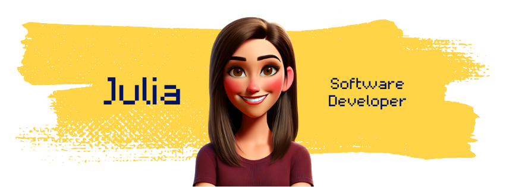

## Hi there 👋

## I'm Julia 👩🏻‍💻

**Frontend Developer**  
🌱 Focused on building interactive, responsive, and user-friendly web applications using **React.js, TypeScript, TailwindCSS** and modern tooling.

## 💻 Tech Stack & Tools

 
  
  
  
  
  
  
  
  
  

## 🌟 Projects I've Built

Here’s a glimpse of what I’ve been working on during my coding journey:

### **1. The Ultimate Movie DB 🎬🍿**

A fully responsive movie browser built with **React**, allowing users to explore, sort, and view detailed movie information. Styled with **TailwindCSS** and **DaisyUI** for a polished UI.

- **Features:**
  - Movie overview grid & detailed view with metadata.
  - Search & sorting functionality.
  - Genre badges using DaisyUI components.
  - Live deployment via Vercel.
- **Tech Stack:**
   
   
   
   
   

### **2. Rock Paper Scissors 🎮**

A modern twist on the classic Rock-Paper-Scissors game — with interactive animations, score tracking, and smooth UX. Great for quick rounds of fun on desktop or mobile.

- **Features:**
  - Animated UI and game transitions.
  - Scoreboard and randomized computer logic.
  - Game reset functionality.
  - Mobile responsive.
- **Tech Stack:**
   
   
   
   

